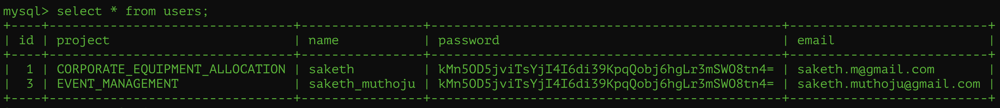
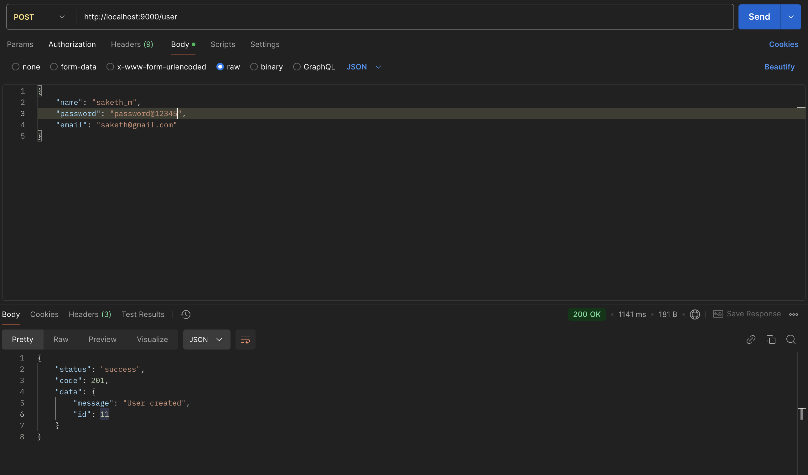
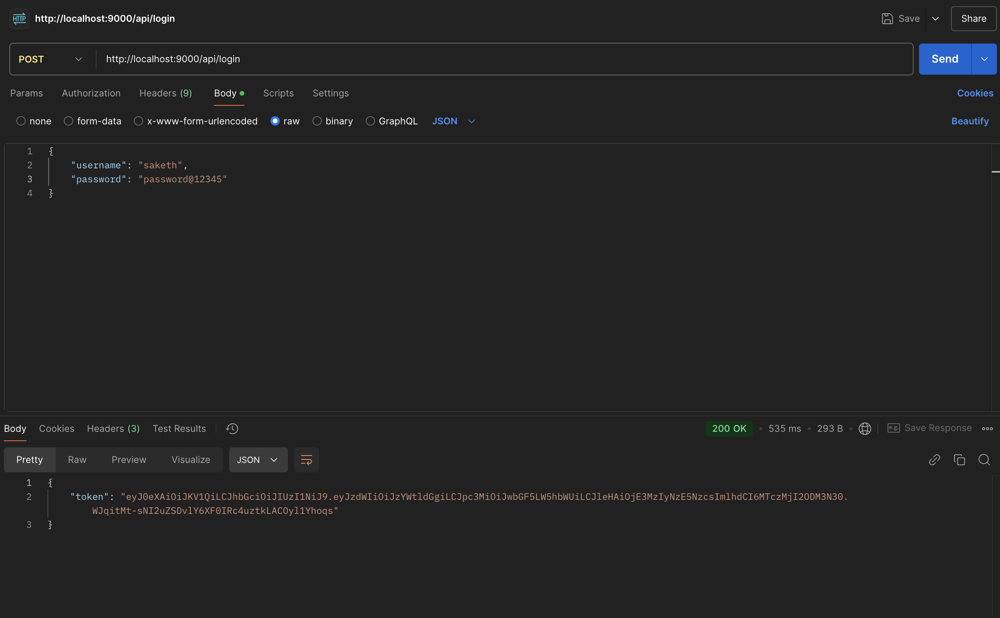
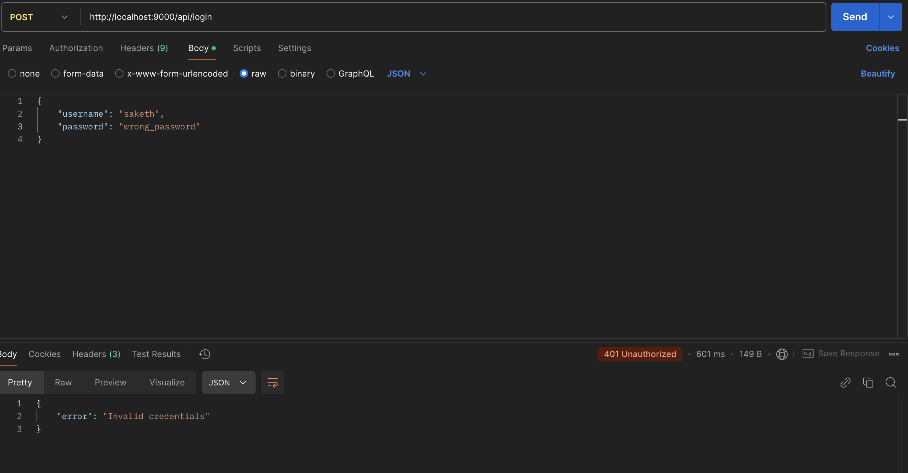
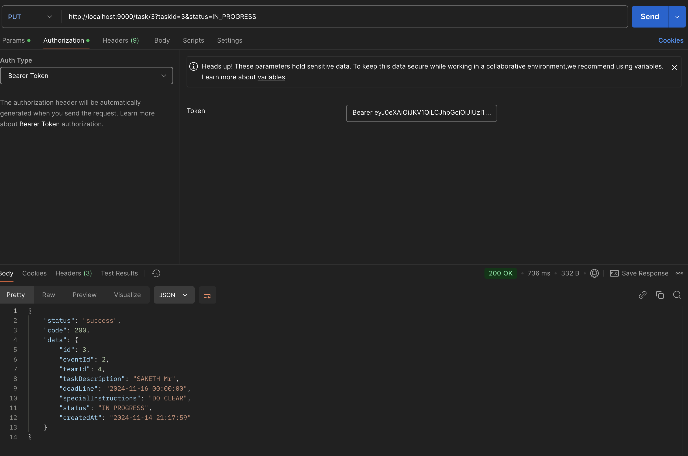
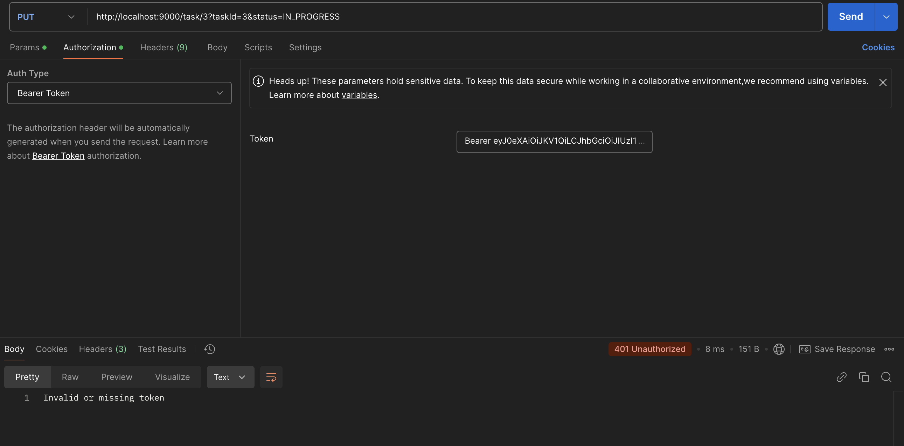
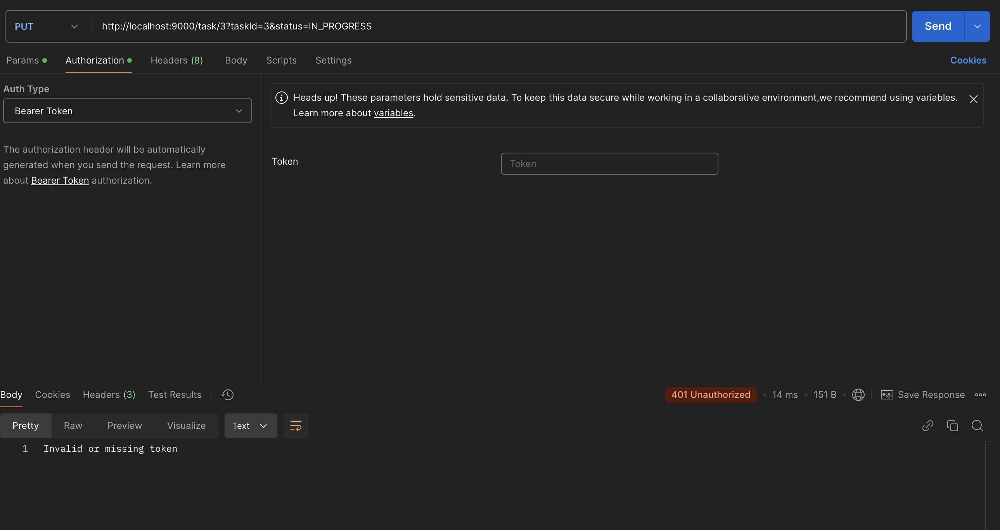

## Day11 tasks

As part of enhancing the security of the API implemented in Week 3, JWT token-based security has been integrated to validate user access. Below are the steps and features implemented:

### Implementation Details
1. User Authentication via Database:
 - A users table was created in the database to store user credentials and associated project details.
 - The table schema includes the following columns: 
   name (string) 
   password (hashed string) 
   email (string) 
   project (string) 
   
2. User Registration:
- User records need to be pre-created in the database.
- For every username, a unique hashed password is stored alongside other details.
   
3. Token Generation:
- A public login API was implemented to accept credentials (username and password).
- Credentials are validated against the database records.
- Upon successful validation, a JWT token is generated and returned to the client.
  
-- This is the successful credentials validation case.
  

-- This is the invalid credentials case.
  

4. Securing APIs:
- Subsequent API requests require the client to include the generated JWT token in the Authorization header.
- Tokens are validated before processing the request to ensure the user is authenticated.

-- This is the successful token validation case.
  

-- This is the invalid token/missing token case.
  
  
