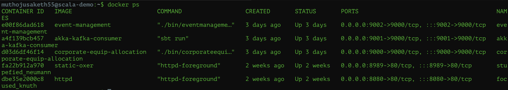
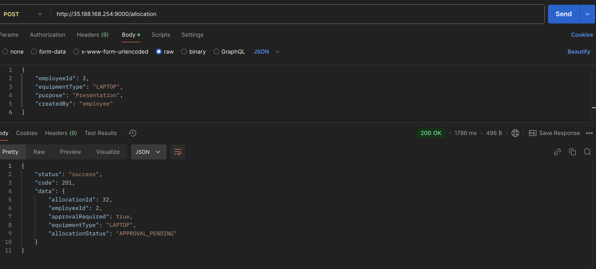
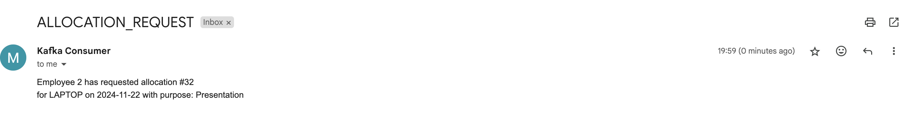
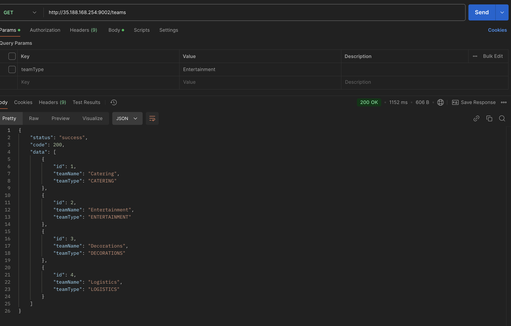

## Day12 tasks

Objective: The goal is to containerize Play Framework and Akka Jobs applications, externalize their configurations using environment variables, and ensure seamless deployment of the entire system, including a Kafka cluster exposed on a public network.

The applications event-management, akka-kafka-consumer, and corporate-equip-allocation have been successfully dockerized and are up and running on their respective ports as follows:

event-management: 
Running at port 9002 (mapped to container's port 9000). 
akka-kafka-consumer: Running at port 9001 (mapped to container's port 9000). 
corporate-equip-allocation: Running at port 9000 (mapped to container's port 9000).

The configurations for these services are managed using environment variables, which are defined in a .env file located at the root of the project. These environment variables are incorporated into the Docker container during the build process through the following command in the Dockerfile:
`COPY .env /app/.env`

----

The Kafka cluster has been successfully set up on the public network, and the topics related to the projects have been created as expected.

To validate the functionality of the applications running on this VM, the APIs were tested.
- API =  `[POST] /allocation` for `corporate-equip-allocation`.
  
  The following API call creates an allocation request for employeeId: 2 with the status "APPROVAL_PENDING", indicating that the request requires manager approval before the equipment can be allocated.
  Upon successful request creation, the application triggers a mail notification using akka-kafka-consumer, as shown in the image below.
  
  This confirms that both the Kafka service and application functionality are working as expected on the VM.

- API =  `[GET] /teams` for `event-management`.
    
  The following API call retrieves a list of teams, confirming that the event-management API is operational. The successful response indicates that the event-management service is functioning as expected.

Both Play Framework services (`corporate-equip-allocation` and `event-management`) along with the Akka service (`akka-kafka-consumer`) have been deployed and validated successfully on the VM.
