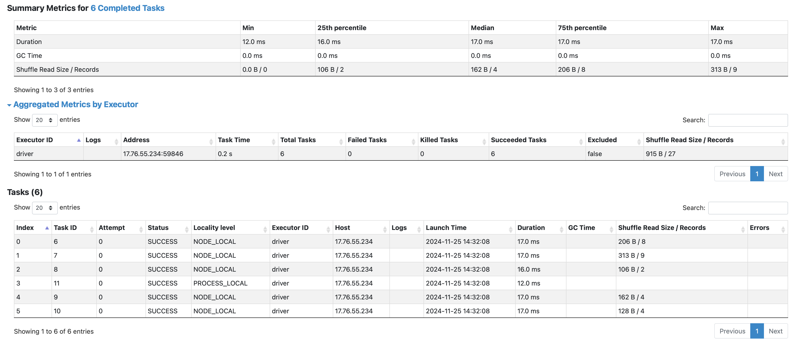
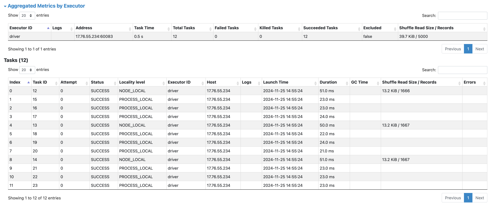

## Exercise-1

This Spark code generates 4 jobs, each resulting from the corresponding action.

### Job 0 
- Operations: .textFile() followed by .foreachPartition().
- Number of tasks: 3, as .textFile() creates 3 partitions by default.
- Stages: 1 stage, since no wide transformations (like shuffles) are involved.

### Job 1
- Operations: .textFile(), .repartition(4), and .foreachPartition().
- Number of tasks:
   - Stage 1: 3 tasks (created by .textFile() with 3 partitions).
   - Stage 2: 4 tasks (created by .repartition(4)).
- Stages: 2 stages, as .repartition() is a wide transformation and requires a shuffle.

### Job 2
- Operations: .textFile(), .repartition(4), .coalesce(2), and .foreachPartition().
- Number of tasks:
    - Stage 1: Skipped (result reused from Job 1's first stage).
    - Stage 2: 2 tasks (created by .coalesce(2)).
- Optimization: Spark avoids creating intermediate 4 partitions from .repartition(4). Instead, the shuffle from .repartition() directly writes the data into 2 partitions as specified by .coalesce().

### Job 3
- Operations: .textFile(), .repartition(4), .coalesce(2), .mapPartitionsWithIndex(), and .collect().
- Number of tasks:
    - Stage 1: Skipped (result reused from Job 1's first stage).
    - Stage 2: 2 tasks (created by .coalesce(2)).
- Stages: 2 stages, as .repartition() introduces a shuffle.

#### NOTE:
- Wide transformations (repartition) introduce shuffles, causing multiple stages.
- Spark optimizes the pipeline by skipping intermediate steps (e.g., directly creating 2 partitions for .coalesce(2) after .repartition(4)).
- Stages are reused across jobs to avoid redundant computation.
-----

## Exercise-2
This Spark code generates 2 jobs,

### Job 0
- Operations: .parallelize(), .map(), .filter(), .groupByKey(), and .saveAsTextFile().
- Stages: 2 stages, as groupByKey() is a wide transformation and requires a shuffle.

### Job 1
- Operations: .parallelize(), .map(), .filter(), .reduceByKey(), and .saveAsTextFile().
- Stages: 2 stages, as reduceByKey() is a wide transformation and requires a shuffle.

#### NOTE:
- Narrow transformations (like `map` and `filter`) typically run in a `single stage`, while wide transformations (like `groupByKey`, `reduceByKey`) involve multiple stages due to the shuffle process.
- It is also observed that `groupByKey` is slower than `reduceByKey` because it shuffles all values for a key, while reduceByKey performs local aggregation before shuffling, reducing the amount of data transferred.
------

## Exercise-3
This Spark code generates a single job with two stages,

Even when spark.executor.instances is set to 2, only one executor will be used in local mode, as local mode is designed to run everything within a single JVM process. Therefore, despite configuring multiple executors, Spark will always allocate a single executor when operating in local mode.

### Stage 0
All tasks in Stage 0 are assigned to the sole executor (ID: driver).

### Stage 1
All tasks in Stage 1 are assigned to the sole executor (ID: driver).

#### NOTE:
- Increasing the number of executor instances allows Spark to distribute tasks across more executors, increasing parallelism.
- More executors mean more resources (memory, CPU) are available to handle tasks.
- Tasks are distributed among available executors. The more executors there are, the more tasks can be processed simultaneously.
---------

## Exercise-4
This Spark code generates a single job with two stages,

### Stage 0
- All narrow transformation tasks which executes independently without shuffling
- Task execution times will likely be uniform across partitions.
- Faster due to in-memory operations and no shuffling.

### Stage 1
- A shuffle occurs due to reduceByKey, which groups data by key across partitions.
- Execution times may vary depending on the size of the data being shuffled.
- Slower due to shuffling overhead and the additional computation required for reduceByKey.

-----------

## Exercise-5

This Spark process results in a total of 9 jobs across three partitioning levels. The RDD initially 2 partitions are determined by the file system’s block size and the size of the input file.

For each partitioning level (2, 4, and 8 partitions), the following jobs were triggered:
- Job for count()
- Job for sortBy()
- Job for saveAsTextFile()

Thus, across 3 partitioning levels, a total of 9 jobs were executed.

#### Partition 2:

#### Partition 4:

#### Partition 8:

#### Observations:
- Number of Tasks and Partitions
  - The number of tasks in a stage is equal to the number of partitions.
  - Increasing the number of partitions decreases the size of each partition.
- Impact of Partition Size on Execution
  - Smaller partitions result in reduced execution time for individual tasks due to smaller data sizes per task.
  - Shuffle size per task is also reduced, as less data is transferred between partitions.
- Trade-Off Between Partition Counts
  - Fewer Partitions
  -- Lower parallelism, leading to longer execution times.Tasks may consume more memory due to larger partition sizes.
  - More Partitions
  -- Increased parallelism but adds overhead in managing a large number of small partitions. Higher shuffling cost due to the fragmentation of data across partitions.

#### Conclusion:
Optimize partitioning by finding a balance: ensure enough partitions for efficient task parallelism while minimizing shuffle overhead. This improves performance and avoids memory or management inefficiencies.