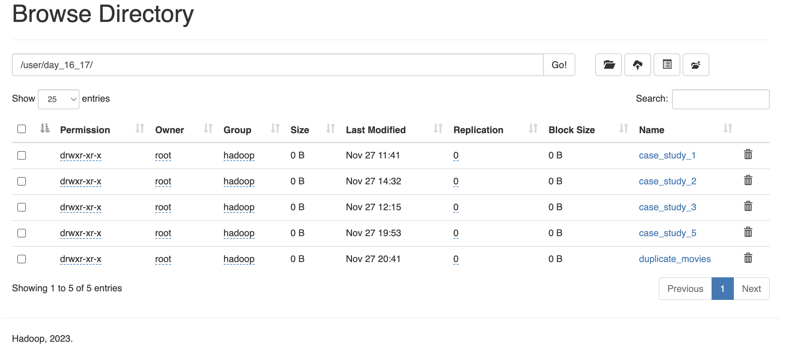
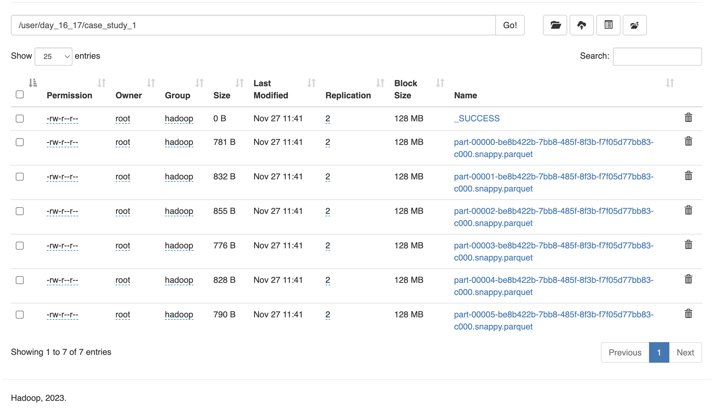
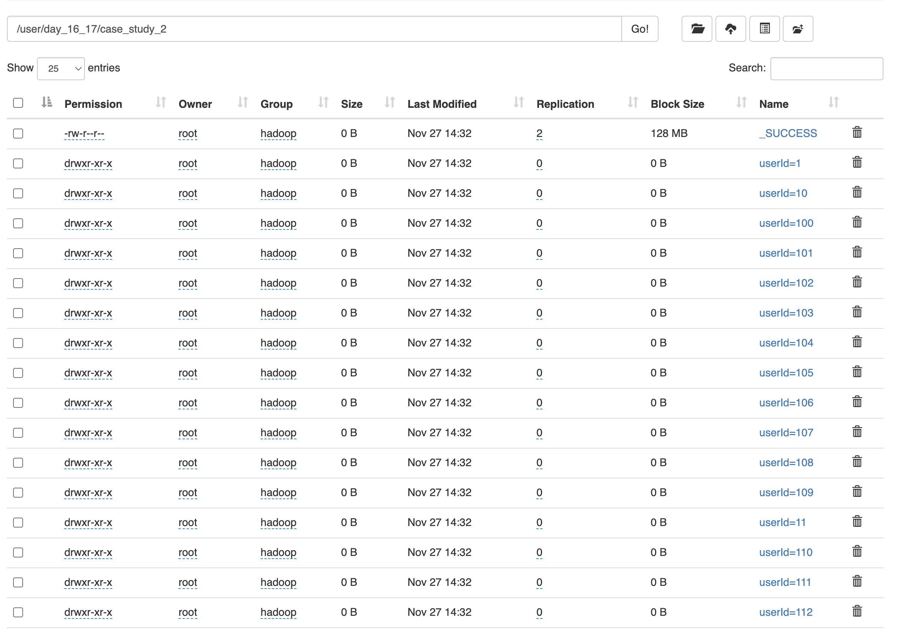
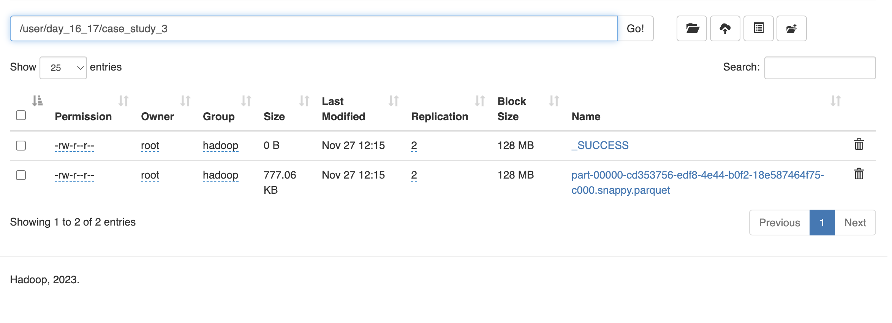
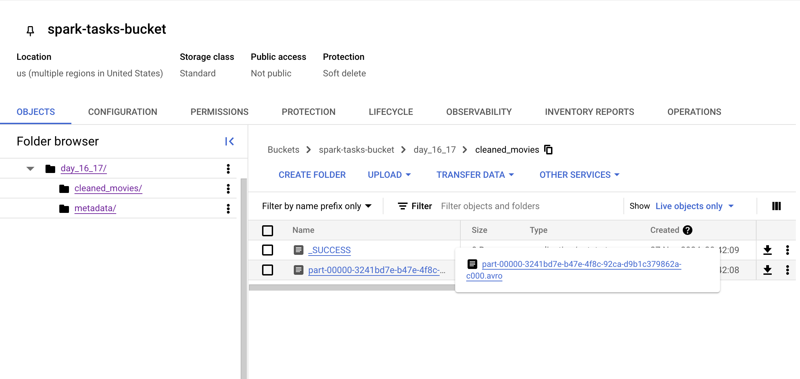
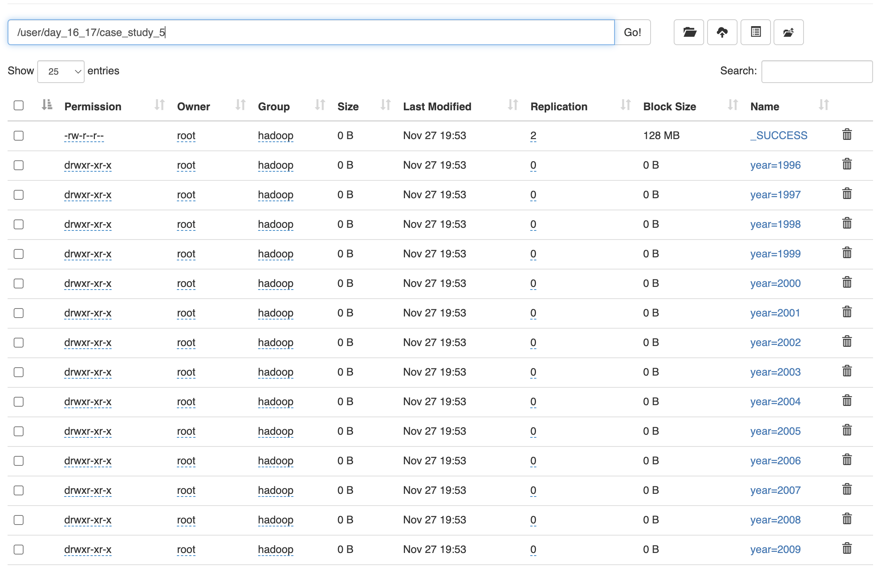

## Day16_17 Tasks

HDFS:



## CaseStudy-1


- The aggregated genre-specific average movie ratings have been successfully stored in HDFS in Parquet file format.
-----

## CaseStudy-2

- The Movielens user ratings data has been successfully partitioned by user and stored in separate folders in HDFS 
------

## CaseStudy-3

- The Movielens movies.csv data has been successfully enriched with the missing releaseYear information from the metadata JSON file (which is generated through code), and the enriched dataset has been stored in Parquet format in HDFS.
---------

## CaseStudy-4

- The duplicate movie records based on movieId and title have been successfully created, identified and removed, and the cleaned data has been saved in Avro format in GCP Cloud Storage.
- Initially, I encountered a spark-avro.jar missing error when attempting to create the Avro files. To resolve this, I followed these steps:

    - Logged into the master node and worker nodes.
    - Navigated to the /lib/spark/jars directory.
    - Executed the command:
```sudo wget https://repo1.maven.org/maven2/org/apache/spark/spark-avro_2.12/3.5.1/spark-avro_2.12-3.5.1.jar.```
    - Stopped and restarted the cluster.
-----------

## CaseStudy-5

- The user ratings data has been successfully partitioned by year, with each year's data saved in separate Parquet files in HDFS