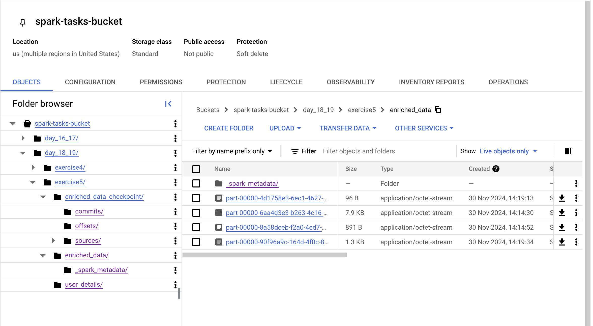
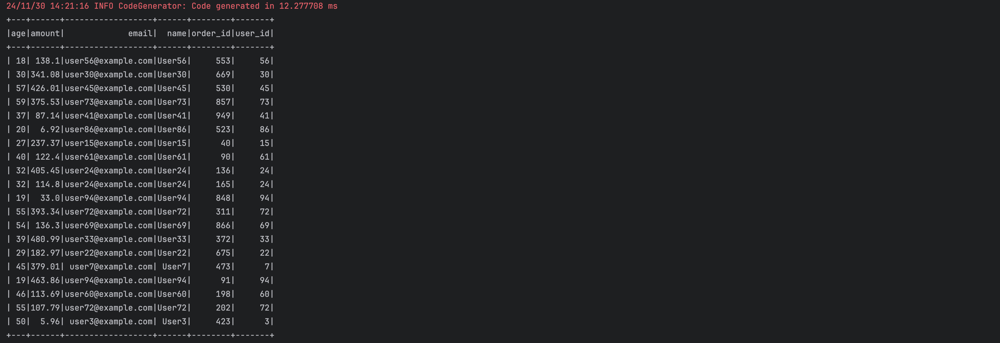

## Day18_19 Tasks

### Exercise-1

- Using broadcasting in Spark optimizes joins by sending the smaller dataset (user details) to all executors.
- This avoids expensive shuffling, enabling faster local joins with the larger dataset (transaction logs).
- Broadcasting reduces network overhead, improves performance, and is ideal when the smaller dataset fits in memory.
-----

### Exercise-2

- Caching reduces execution time because the job does not re-execute all the RDD computations from the beginning.
- Instead, it reuses the cached RDD, avoiding redundant computations and reducing the processing time required to recreate the RDD.
--------

### Exercise-3

The kafka producer sends the messages as shown above.

The Spark Structured Streaming application reads these messages, extracts the required fields, and calculates the total amount in 10-second windows. The processed results are displayed in batches
----------

### Exercise-4

The input and output are successfully created in Parquet format in GCS, as expected.

-----------

### Exercise-5

- The enriched data is successfully written to the GCS path in JSON format.

The Kafka topic produces valid order messages that align with the schema (order_id, user_id, and amount).

#### Enrichment logic

- When user_id is found in the broadcasted user details dataset:
    - The enriched data contains the corresponding name, age, and email mapped from the broadcast dataset.

- When user_id is not found in the broadcasted dataset:
    - Default values are applied, resulting in the following mapping: 
      - Name: "UNKNOWN" 
      - Age: 0 
      - Email: "NOT_AVAILABLE" 
      These default values ensure completeness and consistency in the enriched data output.

