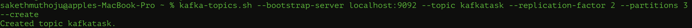
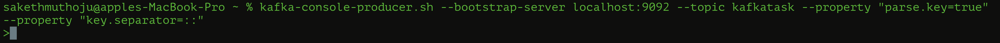
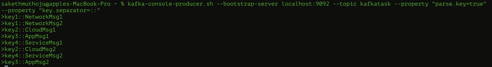
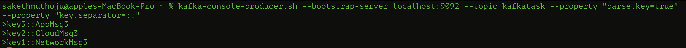
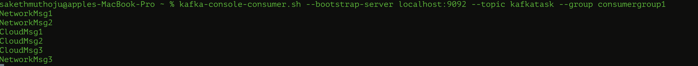
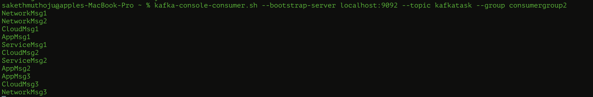
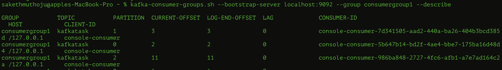
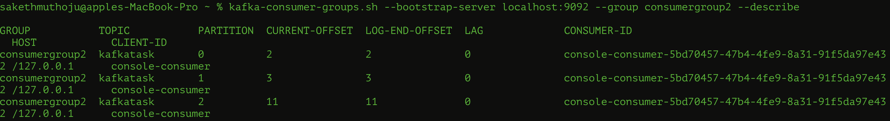
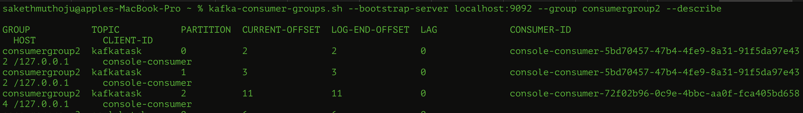

Kafka's fault tolerance is demonstrated by the automatic recovery of the cluster after a temporary issue, maintaining availability throughout. Topic(scalabatch2) has 3 partitions with replication factor of 2. 
In the initial state, all partitions are healthy. Leaders are distributed: Partition 0 (Leader 0), Partition 1 (Leader 2), Partition 2 (Leader 1). Each partition's replicas in sync across the specified brokers. In the second state, the output indicates a degraded state. It suggests there was likely a temporary issue with broker 2, which caused broker 2 to fall out of the ISR for its partitions. The system performed leader election where needed. Hence, leadership changed for Partition 0 from broker 0 to broker 2. In the final state, it shows that the ISR has recovered, with all replicas back in sync and broker 0 has rejoined the ISR. 

Created a producer which produces messages, the consumer consumes these messages. The consumer will start reading from the very first message in each partition, regardless of when it was produced when `--from-beginning` is used. If not, consumer will start reading only the new messages produced after the consumer connects to the topic. 

**NOTE:**ka If producers don’t use keys, messages are randomly distributed across partitions, balancing the load. However, when keys are used, Kafka hashes the key, directing all messages with the same key to the same partition. This ensures order for related messages.

** Question 4 **
-------
-------
 

> A topic(`kafkatask`) is created with 3 Partitions and Replication Factor 2

> Created two producers using CLI. The producers are set up to send messages to the `kafkatask` topic with keys explicitly defined. The `parse.key=true` property enables key-value parsing, while `key.separator=::` specifies :: as the separator between the key and message. Messages with the same key will consistently route to the same partition, ensuring order for related messages within that partition.

> Create two consumer groups: `consumergroup1` and `consumergroup2` 
`consumergroup1` consists of three consumers while `consumergroup2` consists of only one consumer.

> `Producer-1` has produced the messages as -

> `Producer-2` has produced the messages as - 

These messages are consumed by the consumers as -  

- `consumergroup1` consists of three consumers `Consumer-11`, `Consumer-21`, `Consumer-31`. Messages are distributed across these consumers based on the partition key, ensuring that all messages with the same key are consistently routed to the same consumer.

    `Consumer-11` consumes messages with keys: `key1` and `key2`
    

    `Consumer-21` consumes messages with key: `key4`
    

    `Consumer-31` consumes messages with keys: `key3`
    
    

- `consumergroup2` has a single consumer `Consumer-21`, meaning that this consumer will receive all messages from multiple producers, regardless of their keys.

    `Consumer-21` consumes all messages(keys: `key1`, `key2`, `key3` and `key4`)
    

> Hence, the description of the consumer groups are as follows - 

* `consumergroup1` - Partitions are evenly distributed among consumers within the group, with each consumer handling one partition. This distribution is evident by observing the assignment of partitions to each consumer-ID.

* `consumergroup2` -  Since there is only one consumer in this group, all partitions are assigned to this single consumer. This assignment is similarly clear from the partition to consumer-ID mapping.

> Rebalancing Behavior upon Consumer Changes.

When a consumer (`Consumer-11`) is removed from `consumergroup1`, the partitions are automatically redistributed among the remaining consumers in the group. Consequently, one partition is assigned to `Consumer-31`, while `Consumer-21` is allocated two partitions.

 

Similarly, when a new consumer (`Consumer-22`) is added to `consumergroup2`, resulting in two consumers in the group, Kafka redistributes the partitions to balance the load. In this new configuration, `Consumer-22` receives one partition, and `Consumer-21` is assigned two partitions.

 
