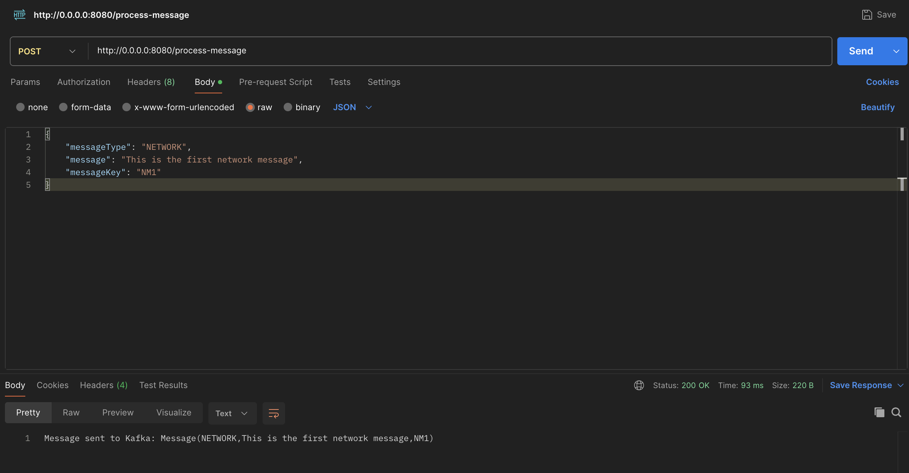
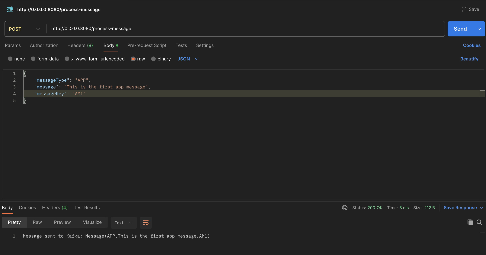
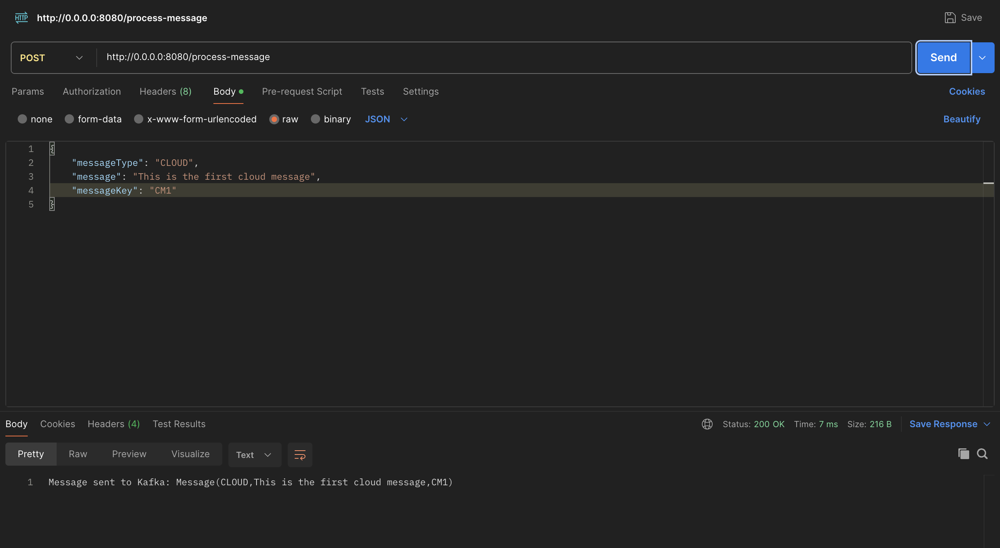
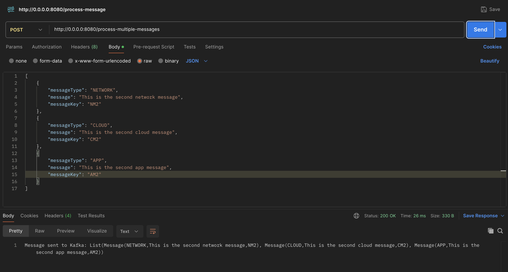
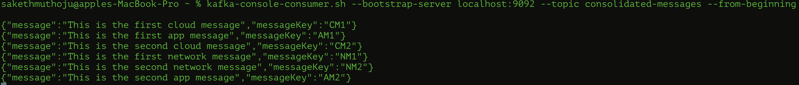

Kafka producer microservice and Kafka consumer microservice:

Supporting multiple message formats:

The consumers receive the message based on the message type:

NetworkMessageListener:

AppMessageListener:

CLoudMessageListener:

Consolidated Messages Topic:

