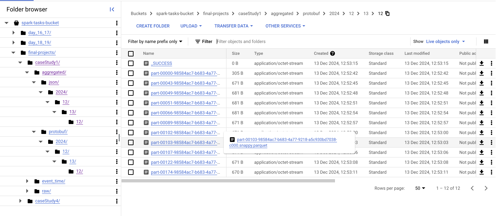

## Real-Time Simulation

### Architectural Diagram


### Compilation and Descriptor Generation Commands:
To generate the compiled files and descriptor files from the .proto file, the following commands are used:
- Generate Compiled Files:
    - SensorReading: ```protoc --descriptor_set_out=src/main/scala/caseStudy1/protobuf/descriptor/SensorReading.desc --include_imports --proto_path=src/main/scala/caseStudy1/protobuf/proto src/main/scala/caseStudy1/protobuf/proto/SensorReading.proto```
    - AggregatedSensorReading: ```protoc --descriptor_set_out=src/main/scala/caseStudy1/protobuf/descriptor/AggregatedSensorReading.desc --include_imports --proto_path=src/main/scala/caseStudy1/protobuf/proto src/main/scala/caseStudy1/protobuf/proto/AggregatedSensorReading.proto```
- Generate Descriptor Files:
  - SensorReading: ```protoc --scala_out=src/main/scala --proto_path=src/main/scala/caseStudy1/protobuf/proto src/main/scala/caseStudy1/protobuf/proto/SensorReading.proto```
  - AggregatedSensorReading```protoc --scala_out=src/main/scala --proto_path=src/main/scala/caseStudy1/protobuf/proto src/main/scala/caseStudy1/protobuf/proto/AggregatedSensorReading.proto```

### Real-Time Data Simulation with Protobuf and Kafka:
- Akka SensorReadings Producer [Produced to Kafka]:


- Once serialized into binary format, the data produced to Kafka appears as:


The Akka producer has successfully produced 1707 messages, all of which have been received by Kafka, ensuring no data loss. 

### Data Processing with Spark Streaming and GCP:
- The serialized data from Kafka is consumed by a Spark Streaming job.


- Stored to GCP based on eventDate


- Stored to GCP based on processingTime


- Aggregated metrics are calculated incrementally using the data from kafka and previous aggregated results


- Aggregated metrics are stored to GCP in protobuf format



- Aggregated metrics are also stored in JSON format to GCP in JSON format


### APIs:

- Aggregated Data API:


- Aggregated Data API for a particular sensorId (sensorId = 1)


### UI:
Used streamlit for UI

- Aggregated Data API called on UI


- Aggregated Data API for particular sensorId (sensorId=1) on UI


### Retention:

The provided logic demonstrates how to identify a folder in GCP that belongs to the current day and is not older than seven days, as outlined in the question. This folder can then be accessed as needed.
Similarly, the logic has been modified to get the target folders older than seven days, which can subsequently be deleted from the file system.

The corresponding implementation can be found [here](retention/RetentionPolicy.scala)


### Test cases:


