## Datasets
The following datasets are located in the `resources` folder:
- `features.csv`
- `stores.csv`
- `train.csv`

These datasets are loaded into Spark DataFrames and validated.

## Enriched Dataset
A cumulative enriched dataset is generated and stored in a GCP bucket.

- Partitioned By: store and date
- Format: .parquet 

Configuration details for GCP storage are available [here](config/Config.scala).
### Enriched Dataset 
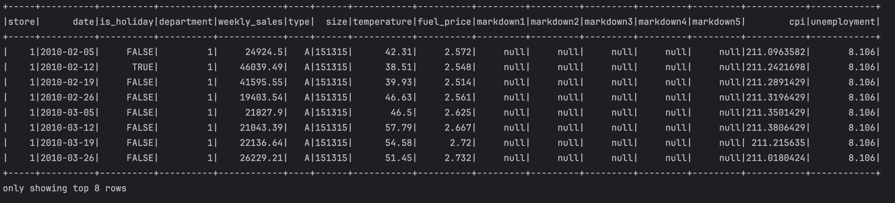
### Partitioned Enriched Data in GCP 
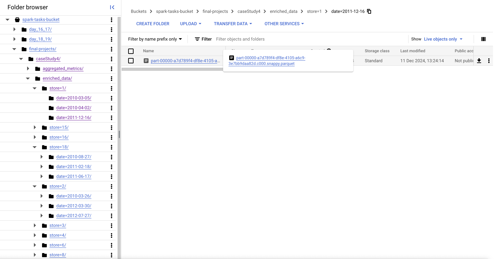


## Key Metrics
### Store-Level Metrics
- **Total Weekly Sales and Average Weekly Sales**:

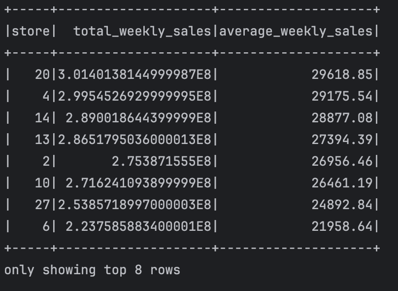

- **Top-Performing Stores**: The number of top-performing stores required in the output can be configured [here](config/Config.scala).

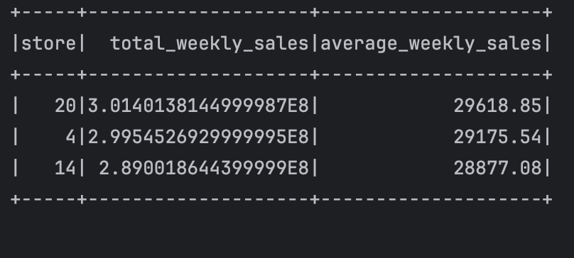

### Department-Level Metrics
- **Total Sales**:

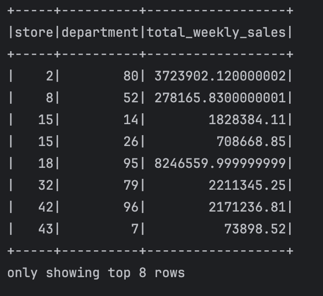

- **Weekly Trends**: Weekly sales trends are computed as the difference in sales from the previous week.

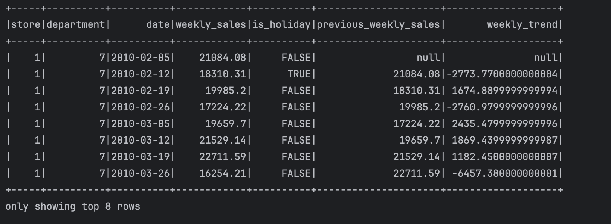

- **Holiday vs. Non-Holiday Sales**:

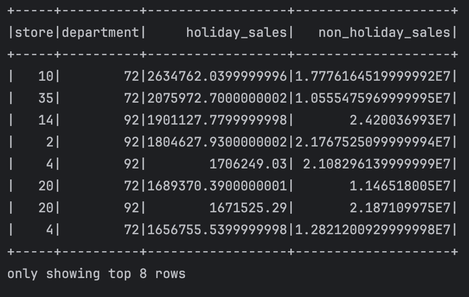


All computed metrics are stored in a GCP bucket under the `aggregated_metrics` folder in `.json` format.
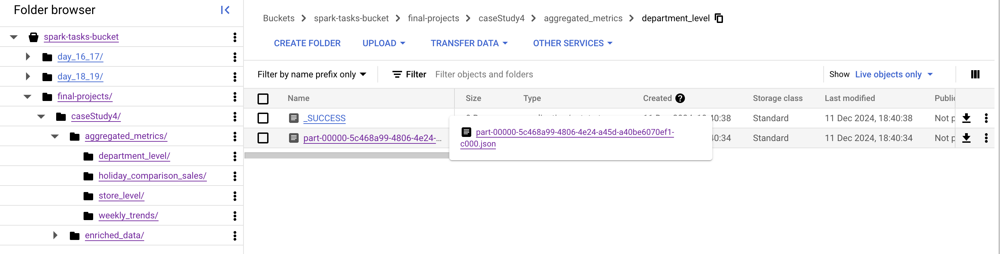


## Real-Time Simulation

#### Compilation and Descriptor Generation Commands:
To generate the compiled files and descriptor files from the .proto file, the following commands are used:
- Generate Compiled Files:
```protoc --descriptor_set_out=src/main/scala/caseStudy4/protobuf/descriptor/WeeklySalesData.desc --include_imports --proto_path=src/main/scala/caseStudy4/protobuf/proto src/main/scala/caseStudy4/protobuf/proto/WeeklySalesData.proto```


- Generate Descriptor Files:
```protoc --scala_out=src/main/scala --proto_path=src/main/scala/caseStudy4/protobuf/proto src/main/scala/caseStudy4/protobuf/proto/WeeklySalesData.proto```


### Real-Time Data Simulation with Protobuf and Kafka:
- Weekly sales updates are serialized using Protobuf and published to a Kafka topic in binary format.
- The raw data produced before serialization appears as follows:

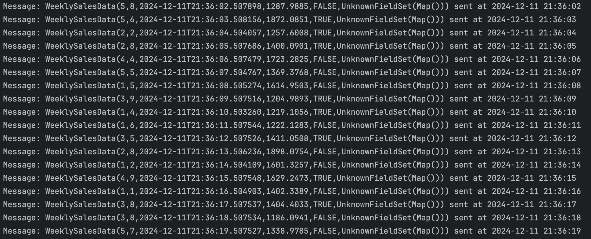

- Once serialized into binary format, the data produced to Kafka appears as:

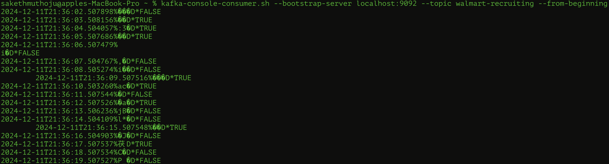


#### Data Processing with Spark Streaming and GCP:
- The serialized data from Kafka is consumed by a Spark Streaming job.
- This streaming job processes the data in real-time, persists it to Google Cloud Platform (GCP), and updates the corresponding metrics.

- Records Before and After Real-Time Simulation:

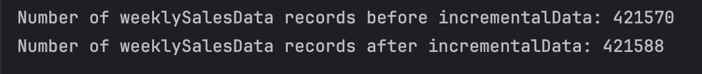

- Store-wise Total Sales Comparison Before and After Real-Time Simulation:

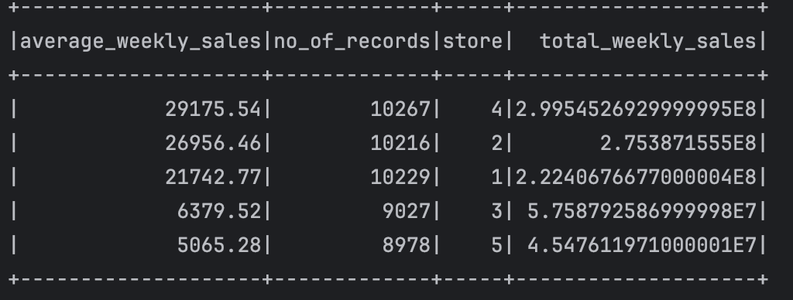
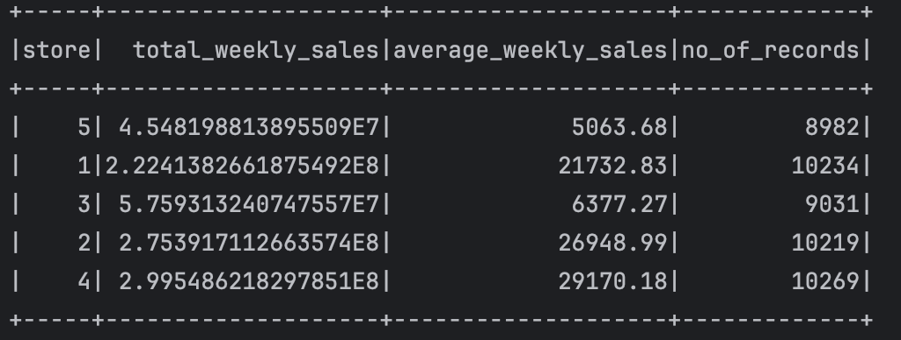

- Department-wise Sales Comparison Before and After Real-Time Simulation:

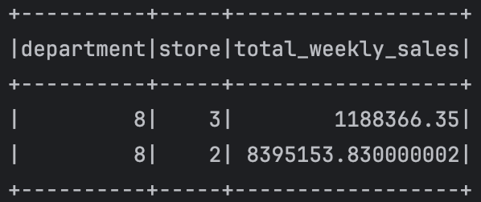
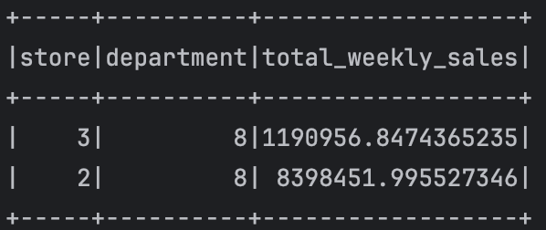

- Holiday Sales Comparison Before and After Real-Time Simulation:

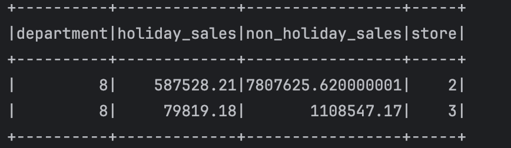
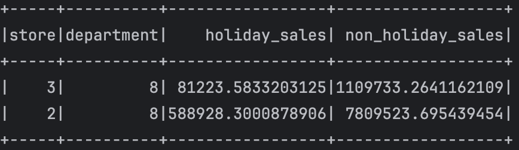
